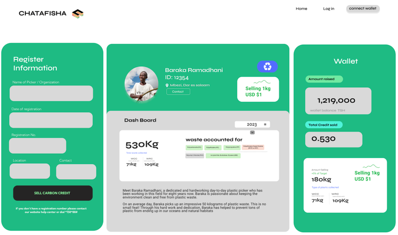
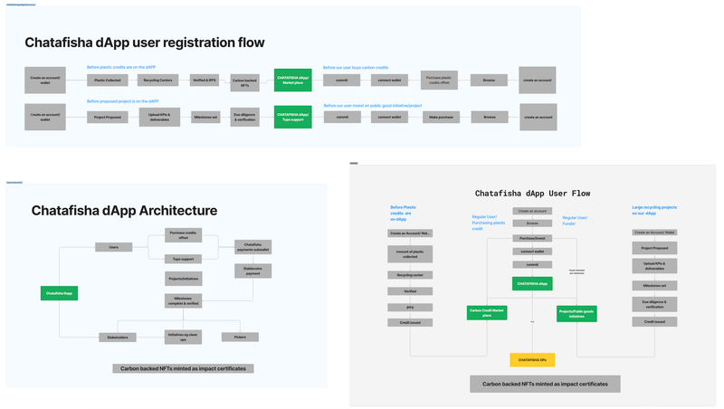
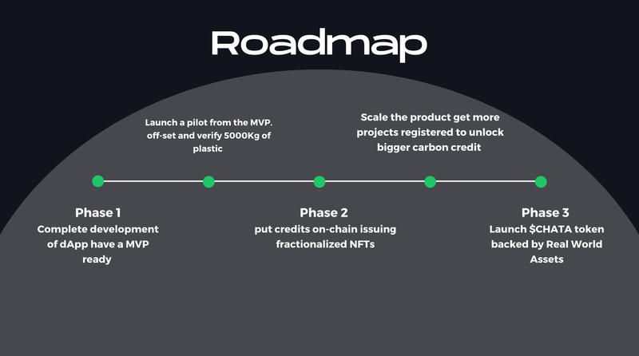

# Description

## Problem statement

Chatafisha comes from two Swahili words, Chata meaning mark and Safisha meaning cleaning. Climate change and Carbon emissions are increasingly worrying factors in the world we live in today yet less attention is paid to. In Africa, we have a serious waste management issue and the exploitative nature of the industry.

At the heart of this challenge lies the marginalized waste pickers, who struggle with inconsistent income, lack of recognition, and limited access to resources. These frontline workers play a vital role in waste collection but remain excluded from the benefits of the value chain. Conventional waste management systems lack transparency, leading to inefficiencies, mistrust, and unsustainable practices. Urgent intervention is needed to empower waste pickers, create a circular economy, and mitigate plastic pollution, while fostering socio-economic development in underserved communities. Chatafisha aims to revolutionize waste management by leveraging blockchain technology to ensure equitable compensation, transparency, and the transformation of plastic waste into eco-products, paving the way for a cleaner planet, empowered waste pickers, and thriving communities. For instance, The average waste picker in Tanzania offsets around 50kg of plastic waste daily for a mere 0.1$ per kg. This is due to the centralized nature of the industry which allows for exploitation of the regenerators that actually do the work.

Furthermore, due to the increasing carbon footprints for organizations and industries, there is lack of proper infrastructures in place to keep track and reduce their carbon footprints, leading to even more emissions.

## Solution Overview

At Chatafisha, we are building a blockchain based infrastructure (dApp) Our decentralized application (dApp) provides a comprehensive solution for tracking and offsetting carbon footprints.

Users in the form of waste pickers, collection points and recyclers can log daily information such as the type, amount, and location of offsets. On the other hand, individuals or organizations looking to offset their carbon footprint can be able to do so transparently through Unique IDs and earn impact certificates.

We offer a transparent method to calculate and offset carbon footprints through waste pickers, integrating a gamification aspect with **Carbon-backed NFTs containing Metadata of the offsets such as name, location, type of waste and amount.** We are also gamifying the process by also introducing a leaderboard game where weekly winners receive various incentives for their participation.

Our dApp also features **sub-wallets** for Financial Transactions and Rewards, ensuring secure and transparent financial transactions between waste pickers, waste collection points, and future buyers of eco-products. With Chatafisha, waste pickers, waste collection points, recyclers can monitor their daily offsets, tracking the amount of plastic waste collected and the environmental impact of their recycling activities.

**_To promote financial inclusion, we've introduced a points system for waste pickers. This innovative approach will enable micro-lending_** in the long run directly to their sub-wallets, providing financial support to waste pickers who are typically unbanked and lack credit.

## dApp Userflow.

For individuals and organizations looking to offset their carbon footprint they can connect their wallet, calculate and select packages to offset for or add the vefified offsets from pickers to their cart and cash out. In the case of social impact projects, they can review uploaded proposals with indicated milestones and deliverables and opt to fund.

Once they fund the projects or select their package, e.g 2 Tonnes monthly, then they will be minted the carbon backed NFT as an impact certificate which contains the metadata as mentioned above.

## Feasibility

Chatafisha Solution Development and Implementation Roadmap:

### Phase 1: Foundation and Platform Development

- Conduct comprehensive market research to understand waste management challenges and opportunities.
- Identify key stakeholders, including waste pickers, recycling centers, manufacturers, and potential users.
- Define the technical requirements for the blockchain-based platform and eco-product marketplace.

### Phase 2: Platform Design and Prototyping

- Develop wireframes and prototypes of the Chatafisha dApp platform, focusing on user experience and functionality.
- Engage with waste pickers' communities for feedback on the design and user interface.
- Begin development of the blockchain infrastructure and backend systems.

### Phase 3: Pilot and Validation

- Pilot communities for the initial rollout of the Chatafisha platform.
- Collaborate with local partners to facilitate waste collection, recycling, and eco-product creation.
- Develop educational materials and workshops to engage waste pickers and users.
- Launch the Chatafisha platform in pilot communities, integrating compensation mechanisms and blockchain transparency.
- Monitor user engagement, collect feedback, and identify areas for improvement.

### Phase 4: Growth and Scaling

- Expand the platform to additional communities and regions with high waste management challenges.
- Collaborate with local governments and NGOs to raise awareness and increase participation.
- Launch marketing campaigns to attract waste pickers, recycling centers, and eco-conscious consumers.

## Impact

Chatafisha's contribution to creating positive change is multi-faceted and extends to the planet, society, and the economy, promoting fairness, transparency, and sustainability:

### 1. Environmental Impact:

- Plastic Waste Reduction: By incentivizing waste pickers to collect plastic waste, Chatafisha reduces plastic pollution in landfills, oceans, and ecosystems, contributing to a cleaner environment and healthier ecosystems.
- Circular Economy Promotion: Chatafisha's platform transforms plastic waste into eco-products, promoting a circular economy where resources are conserved, and the life cycle of materials is extended, reducing the strain on natural resources.

### 2. Social Empowerment:

- Economic Empowerment: Through transparent compensation, Chatafisha empowers waste pickers with steady and fair income, elevating their socio-economic status and contributing to poverty reduction.
- Recognition and Dignity: Our platform recognizes the critical role of waste pickers and provides them with a sense of dignity and respect within their communities, challenging societal stigmatization.

### 3. Transparency and Accountability:

- Trust-Building: Chatafisha's blockchain-based transparency builds trust among stakeholders, ensuring accurate record-keeping and accountability at every stage of waste management, from collection to recycling to product creation.
- Inclusive Participation: Transparent income tracking empowers waste pickers and marginalized communities by providing verifiable data on contributions, fostering inclusivity and fairness.

### 4. Stable and Equitable Economy:

- Income Distribution: Chatafisha's fair compensation mechanisms create stable income streams for waste pickers, promoting financial stability and reducing income inequality within waste-picking communities, most importantly financially including them as most do not have bank accounts.
- Economic Development: The income generated by waste pickers through Chatafisha's platform contributes to local economic development, improving access to education, healthcare, and other essential services.
